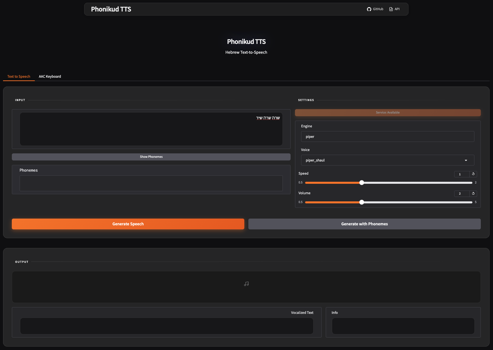
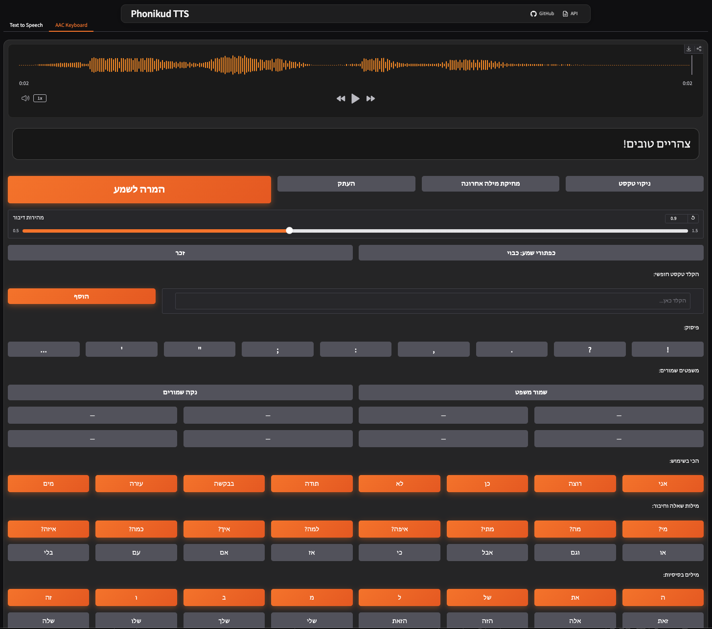

# Phonikud TTS WebUI

A Hebrew text-to-speech web application built on [Phonikud](https://github.com/thewh1teagle/phonikud). This project provides both an API for developers and a web interface for everyday users.

## Preview

**Text to Speech:**



**AAC Keyboard:**



## What This App Does

This application converts Hebrew text into spoken audio. It's designed to be useful for:

- People who have difficulty speaking (AAC - Augmentative and Alternative Communication)
- Developers building Hebrew voice applications
- Anyone who needs Hebrew text read aloud

The app has two main parts:

**Text to Speech** - Type or paste Hebrew text and hear it spoken. You can adjust the speed and volume to your liking.

**AAC Keyboard** - A communication board with pre-made phrases organized by categories like greetings, feelings, needs, and questions. This is helpful for people who need assistance communicating. The keyboard supports both male and female grammatical forms in Hebrew.

## Getting Started

### What You Need

- [uv](https://docs.astral.sh/uv/) - A Python package manager
- Python 3.10 or newer

### Installation

1. Get the code:
```bash
git clone https://github.com/yourusername/phonikud-tts-webui.git
cd phonikud-tts-webui
```

2. Install dependencies:
```bash
uv sync
```

3. Download the speech models:
```bash
uv run python scripts/download_models.py
```

4. Start the server:
```bash
# For most computers (CPU mode)
./start-cpu.sh

# On Windows
.\start-cpu.ps1

# If you have an NVIDIA GPU
./start-gpu.sh
```

After starting, these will be available:
- API: http://localhost:8880
- API Documentation: http://localhost:8880/docs
- Web Interface: http://localhost:8880/web/

### Stopping the Server

Closing the terminal or pressing Ctrl+C may not fully stop the server. Use these commands to ensure it is shut down:

**On macOS/Linux:**
```bash
lsof -ti:8880 | xargs kill -9
```

**On Windows:**
```powershell
# First find the process ID
netstat -ano | findstr :8880
# Then kill it (replace <PID> with the number from the previous command)
taskkill /PID <PID> /F
```

## Using Docker

If you prefer Docker:

```bash
# Build and run everything
docker-compose up --build

# Or just the API
docker build -f docker/Dockerfile -t phonikud-tts:cpu .
docker run -p 8880:8880 phonikud-tts:cpu
```

For GPU support:
```bash
docker build -f docker/Dockerfile.gpu -t phonikud-tts:gpu .
docker run --gpus all -p 8880:8880 phonikud-tts:gpu
```

## For Developers

### OpenAI-Compatible API

The API works like OpenAI's speech endpoint:

```python
from openai import OpenAI

client = OpenAI(
    base_url="http://localhost:8880/v1",
    api_key="not-needed"
)

with client.audio.speech.with_streaming_response.create(
    model="phonikud",
    voice="shaul",
    input="שלום עולם!"
) as response:
    response.stream_to_file("output.wav")
```

### Using httpx directly

```python
import httpx

response = httpx.post(
    "http://localhost:8880/v1/audio/speech",
    json={
        "model": "phonikud",
        "input": "שלום עולם!",
        "voice": "shaul",
        "engine": "piper",
        "speed": 1.0,
    }
)

with open("output.wav", "wb") as f:
    f.write(response.content)
```

### Available Endpoints

| Endpoint | Method | What it does |
|----------|--------|--------------|
| `/v1/audio/speech` | POST | Generate speech from text |
| `/v1/audio/speech/base64` | POST | Generate speech, returns base64 encoded audio |
| `/v1/voices` | GET | List available voices |
| `/v1/voices/{voice_id}` | GET | Get details about a specific voice |
| `/v1/phonemize` | POST | Convert text to phonemes |
| `/v1/health` | GET | Check if the service is running |
| `/v1/engines` | GET | List available TTS engines |

### Request Options

```json
{
  "model": "phonikud",
  "input": "Your Hebrew text here",
  "voice": "shaul",
  "engine": "piper",
  "speed": 1.0,
  "volume_factor": 2.0
}
```

| Parameter | Type | Default | Description |
|-----------|------|---------|-------------|
| `input` | string | required | The Hebrew text to speak |
| `voice` | string | "shaul" | Which voice to use |
| `engine` | string | "piper" | TTS engine (currently "piper") |
| `speed` | float | 1.0 | How fast to speak (0.25 to 4.0) |
| `volume_factor` | float | 2.0 | Volume amplification |

## Configuration

You can set these environment variables:

| Variable | Default | Description |
|----------|---------|-------------|
| `PHONIKUD_HOST` | 0.0.0.0 | Server host address |
| `PHONIKUD_PORT` | 8880 | Server port |
| `PHONIKUD_USE_GPU` | false | Enable GPU acceleration |
| `PHONIKUD_MODELS_DIR` | api/models | Where models are stored |
| `PHONIKUD_DEFAULT_ENGINE` | piper | Default TTS engine |

## Project Layout

```
phonikud-tts-webui/
├── api/
│   └── src/
│       ├── main.py           # FastAPI application
│       ├── core/
│       │   ├── config.py     # Settings
│       │   └── model_manager.py
│       ├── routers/
│       │   ├── speech.py     # Speech generation
│       │   └── voices.py     # Voice information
│       ├── services/
│       │   └── tts_service.py
│       └── schemas/
│           └── audio.py
├── ui/
│   ├── app.py               # Web interface
│   └── lib/
│       ├── interface.py     # UI layout
│       ├── aac_keyboard.py  # AAC communication board
│       └── api.py           # API client
├── scripts/
│   └── download_models.py
├── docker/
│   ├── Dockerfile
│   ├── Dockerfile.gpu
│   └── Dockerfile.ui
├── docker-compose.yml
├── pyproject.toml
├── start-cpu.sh
├── start-gpu.sh
└── README.md
```

## Thanks

This project builds on:
- [Phonikud](https://github.com/thewh1teagle/phonikud) - Hebrew text to phoneme conversion
- [phonikud-tts](https://github.com/thewh1teagle/phonikud-tts) - The TTS library
- [Kokoro-FastAPI](https://github.com/remsky/Kokoro-FastAPI) - UI design inspiration

## Important Note About the Voice

The voice model included in this project (Shaul) is for research and personal use only. Commercial use is not permitted. If you plan to use this in a commercial product, you will need to obtain appropriate voice licensing.

## License

MIT License for the code. Note that the Phonikud models and voice data have their own license terms - please check those before use.

## Citation

If you use Phonikud in research:

```bibtex
@misc{kolani2025phonikud,
  title={Phonikud: Hebrew Grapheme-to-Phoneme Conversion for Real-Time Text-to-Speech},
  author={Yakov Kolani and Maxim Melichov and Cobi Calev and Morris Alper},
  year={2025},
  eprint={2506.12311},
  archivePrefix={arXiv},
  primaryClass={cs.CL},
  url={https://arxiv.org/abs/2506.12311},
}